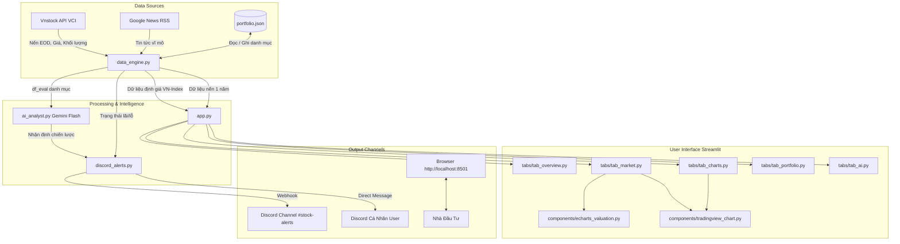

# 🏛️ CẤU TRÚC DỰ ÁN & HƯỚNG DẪN TÁI HIỆN (PROJECT STRUCTURE)

Tài liệu này tổng hợp toàn bộ kiến trúc mã nguồn, vai trò từng tệp tin và luồng dữ liệu (Data Flow) của hệ thống **AI Stock Copilot**. Sau này nếu bạn muốn làm lại từ đầu hoặc mở rộng dự án, hãy bám sát tài liệu này.

---

## 1. 📂 Sơ Đồ Cấu Trúc Thư Mục (Folder Structure)

```text
Stock - learning/
│
├── app.py                      # 🚀 TẦNG ĐIỀU PHỐI (Entrypoint - ~85 dòng)
│                               # Quản lý giao diện tổng thể, CSS Dark Theme, Sidebar và chia Tab.
│
├── components/                 # 📊 TẦNG HIỂN THỊ ĐỒ THỊ (Visualization Components)
│   ├── __init__.py             # Export các hàm vẽ biểu đồ
│   ├── tradingview_chart.py    # Nhúng TradingView Lightweight Charts 60 FPS Native
│   │                           # - Dropdown chọn timeframe: 1m, 5m, 15m, 30m, 1h, 1D, 1W, 1M
│   │                           # - Loại bỏ 00:00:00 (chỉ hiển thị ngày)
│   │                           # - Thanh công cụ bật/tắt chỉ báo: MA, EMA, MACD, RSI, BOLL
│   └── echarts_valuation.py    # Nhúng Apache ECharts định giá thị trường
│                               # - Biểu đồ kép: Điểm số VN-INDEX (cột trái) vs P/E hoặc P/B (cột phải)
│                               # - Căn lề cố định chống cắt chữ (/NINDEX)
│                               # - Đường Định giá Trung bình (Mean Valuation Line: TB: ...x)
│                               # - Thanh trượt DataZoom tương tác cuộn chuột mượt mà
│
├── tabs/                       # 📑 TẦNG GIAO DIỆN CHỨC NĂNG (Feature Tabs)
│   ├── __init__.py             # Export các hàm render Tab
│   ├── tab_overview.py         # Tab 1: 4 Thẻ KPI vốn/lợi nhuận, 2 nút bắn Discord (Kênh + DM), bảng trạng thái CP
│   ├── tab_market.py           # Tab 2: VN-Index nến 60 FPS, bộ chọn bố cục định giá (Toàn cảnh P/E, P/B, Song song)
│   ├── tab_charts.py           # Tab 3: Biểu đồ kỹ thuật phân tích chi tiết cho từng mã CP trong danh mục
│   ├── tab_portfolio.py        # Tab 4: Bảng st.data_editor chỉnh sửa trực tiếp danh mục & lưu file
│   └── tab_ai.py               # Tab 5: Giao diện gửi câu hỏi và nhận báo cáo từ chuyên gia chiến lược AI Gemini
│
├── data_engine.py              # ⚙️ TẦNG DỮ LIỆU (Data Layer)
│                               # - load_portfolio() / save_portfolio(): Đọc/ghi portfolio.json
│                               # - fetch_stock_technical(): Kéo nến từ Vnstock (VCI), tính MA20, MA50, RSI14, Vol/TB20
│                               # - evaluate_portfolio(): Tính lãi/lỗ và định giá danh mục
│                               # - get_stock_chart_data(): Lấy lịch sử 1 năm nến vẽ TradingView
│                               # - get_vnindex_valuation_data(): Lấy dữ liệu VN-Index kèm chuỗi P/E, P/B
│                               # - fetch_macro_news(): Crawl tin tức vĩ mô qua Google News RSS
│
├── ai_analyst.py               # 🧠 TẦNG TRÍ TUỆ NHÂN TẠO (AI Layer)
│                               # - generate_portfolio_analysis(): Dùng google-genai (Gemini Flash) phân tích đa chiều
│
├── discord_alerts.py           # 🔔 TẦNG CẢNH BÁO (Notification Layer)
│                               # - send_discord_webhook(): Gửi Rich Embed độc quyền vào kênh Discord qua Webhook
│                               # - send_discord_dm(): Gửi tin nhắn trực tiếp (DM) vào tài khoản Discord cá nhân
│                               # - send_discord_message(): Gửi thông báo tự động (ưu tiên Webhook, fallback DM)
│                               # - format_portfolio_embed(): Định dạng màu sắc và bảng dữ liệu theo chuẩn Discord
│
├── trading_bot.py              # 🤖 TẦNG TỰ ĐỘNG HÓA 24/7 (Trading Bot Daemon)
│                               # - Chạy nền 24/7 độc lập theo múi giờ Asia/Ho_Chi_Minh (UTC+7)
│                               # - Quét rủi ro mỗi 30s: Cảnh báo Stop Loss (-5%/-7%), gãy MA20 (< 0.5s)
│                               # - Đặt lịch gửi báo cáo chiến lược AI: 08:45 (ATO), 11:30 (Trưa), 14:45 (ATC)
│
├── run_cloud.py                # ☁️ Kịch bản chạy song song Streamlit Web + Bot Daemon trên Cloud
├── Procfile                    # Chỉ thị lệnh khởi chạy cho Render.com / Koyeb
├── portfolio.json              # 💾 Dữ liệu danh mục cổ phiếu mẫu (symbol, volume, cost_price, note)
├── requirements.txt            # Danh sách thư viện Python cần cài đặt
├── run_dashboard.bat           # File kịch bản chạy nhanh dashboard trên Windows với 1 cú click
├── run_bot.bat                 # File kịch bản chạy nhanh bot ngầm trên Windows với 1 cú click
├── .env.example                # File mẫu cấu hình biến môi trường (API Key, Webhook URL, Bot Token)
└── .env                        # [BẢO MẬT - GITIGNORED] Chứa API Key thật của bạn
```

---

## 2. 🔄 Sơ Đồ Luồng Dữ Liệu (Data Flow Architecture)



---

## 3. 🛠️ Quy Trình Tái Hiện Dự Án Từ Đầu (Rebuild Checklist)

Nếu bạn muốn tạo lại dự án này trên một máy tính mới, hãy làm theo các bước chuẩn:

### Bước 1: Khởi tạo môi trường ảo
```powershell
python -m venv $HOME\.venv
& "$HOME\.venv\Scripts\Activate.ps1"
python -m pip install -U pip
```

### Bước 2: Cài đặt thư viện cốt lõi (`requirements.txt`)
```text
streamlit>=1.40.0
vnstock>=4.0.7
google-genai>=1.0.0
feedparser>=6.0.11
python-dotenv>=1.0.1
requests>=2.31.0
pandas>=2.0.0
numpy>=1.24.0
```
Cài đặt bằng lệnh:
```powershell
pip install -r requirements.txt
```

### Bước 3: Cấu hình file `.env`
Tạo file `.env` tại thư mục gốc với các thông số:
```env
# 1. Google Gemini Flash API Key (Miễn phí tại aistudio.google.com)
GEMINI_API_KEY="AIzaSy..."

# 2. Discord Webhook URL (Để bắn tin vào kênh chung)
DISCORD_WEBHOOK_URL="https://discord.com/api/webhooks/..."

# 3. Discord Bot Token & User ID (Tùy chọn - Để bot bắn tin nhắn riêng DM)
DISCORD_BOT_TOKEN="MTM..."
DISCORD_USER_ID="123456789012345678"
```

### Bước 4: Chạy Dashboard
```powershell
streamlit run app.py
```
Hoặc nhấp đúp chuột vào file `run_dashboard.bat`.
Mở trình duyệt truy cập: `http://localhost:8501`.
