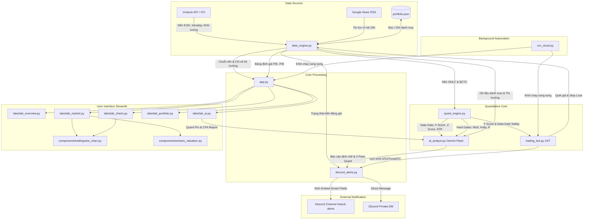

# 🏛️ CẤU TRÚC DỰ ÁN & HƯỚNG DẪN TÁI HIỆN (PROJECT STRUCTURE)

Tài liệu này tổng hợp toàn bộ kiến trúc mã nguồn, cấu trúc thư mục, vai trò từng tệp tin và luồng dữ liệu (Data Flow) của hệ thống **AI Stock Copilot**. Khi cần mở rộng tính năng, bảo trì hoặc deploy lên môi trường Production (Render, Koyeb, Streamlit Cloud), hãy bám sát tài liệu này.

---

## 1. 📂 Sơ Đồ Cấu Trúc Thư Mục (Folder Structure)

```text
Stock - learning/
│
├── app.py                      # 🚀 TẦNG ĐIỀU PHỐI CHÍNH (Entrypoint Streamlit)
│                               # - Thiết lập cấu hình trang, CSS tùy chỉnh giao diện sáng/tối
│                               # - Sidebar điều hướng và thanh điều phối 5 Tab nghiệp vụ
│
├── components/                 # 📊 TẦNG THÀNH PHẦN BIỂU ĐỒ (Visualization Components)
│   ├── __init__.py             # Export các hàm render biểu đồ
│   ├── tradingview_chart.py    # Nhúng TradingView Lightweight Charts 60 FPS Native:
│   │                           # - Hỗ trợ đa khung thời gian: 1m, 5m, 15m, 30m, 1h, 1D, 1W, 1M
│   │                           # - Subpanel tách riêng: Khối lượng (Volume), MACD, RSI
│   │                           # - Kéo thả thay đổi độ cao các subpanel (.pane-resizer)
│   │                           # - Đường dóng dọc liền mạch tuyệt đối (#v-crosshair-line)
│   │                           # - Định dạng ngày tháng tiếng Việt chuẩn (DD Tháng MM 'YY)
│   │                           # - Khóa đồng bộ chiều rộng trục giá (minimumWidth: 72)
│   │                           # - Nạp dữ liệu Whitespace đồng bộ hóa 100% trục thời gian
│   └── echarts_valuation.py    # Nhúng Apache ECharts định giá bội số P/E & P/B:
│                               # - Biểu đồ kép: VN-INDEX (trục trái) vs P/E hoặc P/B (trục phải)
│                               # - Đường Định giá Trung bình Lịch sử (Mean Valuation Line)
│                               # - Thanh trượt tương tác DataZoom mượt mà ở đáy
│                               # - Bố cục thoáng đãng, chống đè chữ và che nhãn ngày tháng
│
├── tabs/                       # 📑 TẦNG GIAO DIỆN NGHIỆP VỤ (Feature Tabs)
│   ├── __init__.py             # Export các hàm render Tab
│   ├── tab_overview.py         # Tab 1: Tổng quan Thị trường & Danh mục:
│   │                           # - Thẻ KPI vốn đầu tư, lãi/lỗ danh mục thời gian thực
│   │                           # - Bản đồ dòng tiền & sóng ngành nóng trong phiên
│   │                           # - Tin tức vĩ mô 24h dạng card hiện đại với nhãn chủ đề
│   │                           # - Nút kích hoạt gửi báo cáo thủ công qua Discord (Kênh / DM)
│   ├── tab_market.py           # Tab 2: Thị trường & Bội số Định giá:
│   │                           # - Header Responsive Card chống cắt số liệu (chống ellipsis 1,79...)
│   │                           # - Thống kê thanh khoản (CP, Tỷ) với màu trung tính chuẩn tài chính
│   │                           # - Độ rộng thị trường: Số mã tăng (trần), giảm (sàn), tham chiếu
│   │                           # - Biểu đồ nến TradingView VN-INDEX toàn màn hình
│   │                           # - Bộ chọn bố cục định giá: Toàn cảnh P/E, Toàn cảnh P/B, Song song
│   ├── tab_charts.py           # Tab 3: Biểu đồ Kỹ thuật Cổ phiếu:
│   │                           # - Soi kỹ thuật chuyên sâu từng mã trong danh mục nắm giữ
│   ├── tab_portfolio.py        # Tab 4: Quản lý Danh mục Đầu tư:
│   │                           # - Bảng st.data_editor chỉnh sửa trực tiếp số lượng, giá vốn
│   │                           # - Lưu trữ bền vững vào file portfolio.json
│   └── tab_ai.py               # Tab 5: Trợ lý Phân tích Chiến lược AI:
│                               # - Chế độ 1: Báo cáo Định chế 8 Trụ cột chuẩn CFA (Cảnh báo 🟢🟡🔴)
│                               # - Chế độ 2: Lượng hóa 2 Lượt (Quantamental Pro): Data Gate + EV + MoS + Kelly
│                               # - Mô phỏng 4 kịch bản rủi ro thị trường & chu kỳ sóng Elliott / Wyckoff
│
├── quant_engine.py             # 📐 TẦNG TÍNH TOÁN ĐỊNH LƯỢNG TẤT ĐỊNH (Deterministic Quant Engine)
│                               # - Data Gate: Kiểm tra tính mới BCTC và thanh khoản tối thiểu ADV20
│                               # - Piotroski F-Score (0-9): Chấm điểm chất lượng tài chính và khả năng sinh lời
│                               # - Altman Z-Score: Đo lường nguy cơ kiệt quệ tài chính (Vùng xanh/xám/đỏ)
│                               # - ATR(14) Volatility Stop-Loss: Tính toán cắt lỗ động theo biến động giá thực tế
│                               # - Tam giác định giá & Hàng rào quyết định: Expected Value, MoS %, Kelly f*
│
├── data_engine.py              # ⚙️ TẦNG DỮ LIỆU & TÍNH TOÁN (Data Layer)
│                               # - Kéo dữ liệu nến EOD/Intraday từ Vnstock (nguồn VCI)
│                               # - Tính toán chỉ báo kỹ thuật: MA20, MA50, RSI14, Vol/SMA20
│                               # - Thu thập chuỗi định giá lịch sử P/E, P/B toàn thị trường
│                               # - Crawl tin tức vĩ mô tự động qua Google News & CafeF RSS
│                               # - Quản lý đọc/ghi danh mục đầu tư portfolio.json
│
├── ai_analyst.py               # 🧠 TẦNG TRÍ TUỆ NHÂN TẠO (AI Layer)
│                               # - Tích hợp mô hình Gemini Flash qua thư viện google-genai
│                               # - Khung phân tích thẻ XML chuẩn hóa (<ROLE>, <DATA_DICTIONARY>, <GUARDRAILS>)
│                               # - Quy trình Lượng hóa 2 Lượt: Pass 1 gán xác suất JSON -> Python tính toán -> Pass 2 viết báo cáo
│                               # - Bộ lọc tất định sanitize_ai_text() triệt tiêu 100% chữ Hán / tiếng Trung
│
├── discord_alerts.py           # 🔔 TẦNG CẢNH BÁO TỰ ĐỘNG (Notification Layer)
│                               # - Gửi Rich Embed chuyên nghiệp qua Discord Webhook
│                               # - Gửi Direct Message (DM) trực tiếp tới Discord User cá nhân
│                               # - Bộ tách đoạn thông minh bằng Regex: Tự động đánh số phần (Phần 2, Phần 3), xóa bỏ lỗi lặp
│
├── trading_bot.py              # 🤖 TẦNG TỰ ĐỘNG HÓA 24/7 (Background Trading Bot)
│                               # - Tiến trình độc lập theo múi giờ Việt Nam (UTC+7)
│                               # - Canh thị trường định kỳ: Stop Loss linh hoạt, cảnh báo nổ Vol / gãy MA20
│                               # - Hàng rào an toàn định lượng: Kiểm tra Data Gate & F-Score trước khi bắn tín hiệu Mua
│                               # - Đặt lịch tự động bắn báo cáo: ATO (08:45), Trưa (11:30), ATC (14:45)
│
├── rule.md                     # 📜 ĐẶC TẢ QUY TẮC DỰ ÁN & CHUẨN HÓA HỆ THỐNG
│                               # - Zero Chinese Token Policy & Chuẩn hóa tên mã SSI
│                               # - Kiến trúc phòng thủ 2 lớp (Two-tier Defense Architecture)
│                               # - Quy chuẩn Kiến trúc Lượng hóa 2 Lượt (Quantamental 2-Pass Pipeline)
│
├── run_cloud.py                # ☁️ TIẾN TRÌNH KHỞI CHẠY CLOUD (Dual-Process Runner)
│                               # - Chạy ngầm Trading Bot Daemon (Thread 1)
│                               # - Chạy Web Dashboard Streamlit trên cổng $PORT (Thread 2)
│                               # - Chuyên biệt cho Render.com, Koyeb, Linux VPS
│
├── scripts/                    # 🛠️ THƯ MỤC CÔNG CỤ & KỊCH BẢN WINDOWS LOCAL
│   ├── run_dashboard.bat       # Khởi chạy Dashboard Streamlit trên Local
│   ├── run_bot.bat             # Khởi chạy độc lập Trading Bot giám sát thị trường
│   ├── clean_cache.bat         # 1-click dọn sạch bytecode và thư mục __pycache__
│   ├── simulate_morning_report.py   # Giả lập và bắn báo cáo ATO 08:45 AM
│   └── simulate_afternoon_report.py # Giả lập và bắn báo cáo kết phiên 15:00 PM
│
├── portfolio.json              # 💾 Cơ sở dữ liệu danh mục cổ phiếu mẫu
├── requirements.txt            # Danh sách thư viện Python phụ thuộc
├── Procfile                    # File khai báo tiến trình Web cho Render / Heroku
├── run_dashboard.bat           # File khởi chạy nhanh dashboard tại thư mục gốc
└── .env                        # [BẢO MẬT - GITIGNORED] Khóa API thực tế
```

---

## 2. 🔄 Sơ Đồ Luồng Dữ Liệu (Data Flow Architecture)



---

## 3. 🛡️ Quy Tắc Triển Khai & Phân Loại File (Deployment Hygiene)

1. **Thư mục gốc (Root Directory)**:
   * Chỉ giữ các tệp Python cốt lõi phục vụ Production: `app.py`, `run_cloud.py`, `data_engine.py`, `ai_analyst.py`, `trading_bot.py`, `discord_alerts.py`, `Procfile`, `requirements.txt`.
   * Các tệp cấu hình: `.env.example`, `.gitignore`, `portfolio.json`.
2. **Thư mục `scripts/`**:
   * Chứa toàn bộ kịch bản batch (`.bat`) trên hệ điều hành Windows. Render / Koyeb chạy Linux sẽ bỏ qua các file này, giúp quá trình Build Image nhanh và không bị lỗi file lạ.
3. **Thư mục `components/` & `tabs/`**:
   * Phân tách mạch lạc giữa tầng render biểu đồ độc lập và tầng giao diện chức năng của Streamlit.
