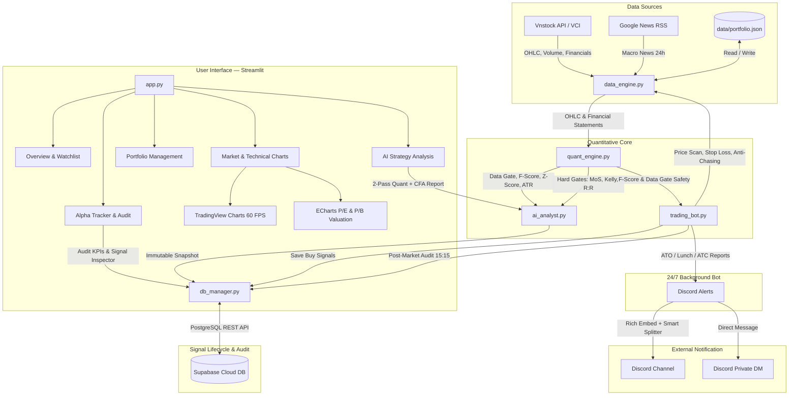
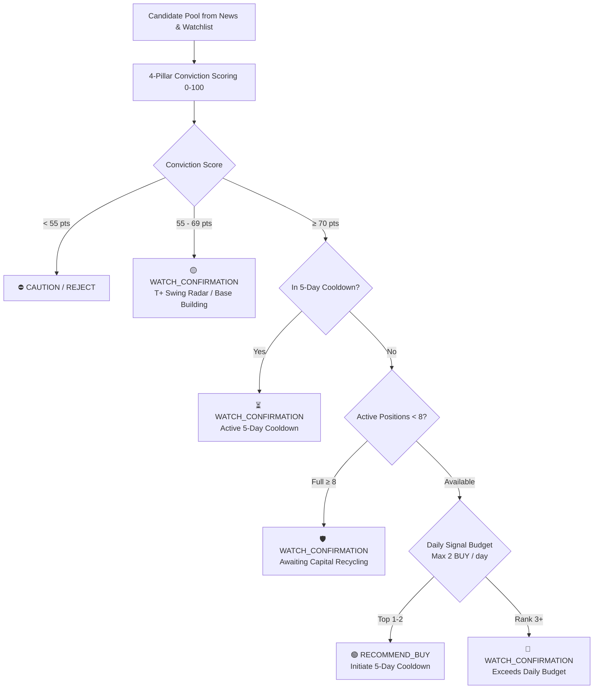
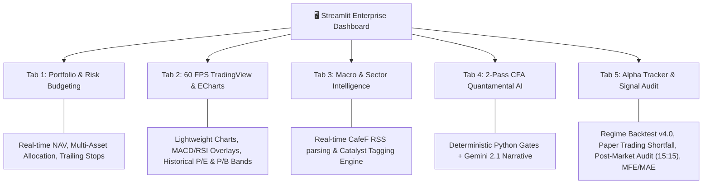
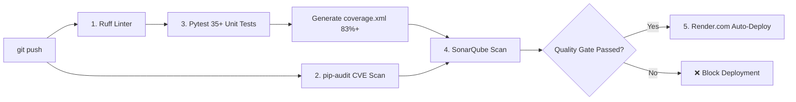

[](https://sonarcloud.io/summary/new_code?id=VinhTung1410_Stock-AI)
[](https://sonarcloud.io/summary/new_code?id=VinhTung1410_Stock-AI)
[](https://sonarcloud.io/summary/new_code?id=VinhTung1410_Stock-AI)
[](https://sonarcloud.io/summary/new_code?id=VinhTung1410_Stock-AI)


# Stock-AI 📈

> A quantamental stock analysis system that eliminates LLM hallucination through deterministic hard gates — built for the Vietnam stock market.

**[🌐 Live Demo](https://stock-ai-recq.onrender.com/)** · **[🧭 AI Product Case Study](docs/PRODUCT_CASE_STUDY.md)** · **[📖 Architecture Docs](docs/PROJECT_STRUCTURE.md)** · **[📜 System Rules](docs/rule.md)**

---

## The Problem

Retail investors in Vietnam increasingly rely on AI (ChatGPT, Gemini) for stock analysis. But LLMs **hallucinate financial numbers** — a 15% ROE becomes 51%, a P/E of 8 becomes 18.

Wrong numbers → wrong buy/sell signals → **real money lost**.

## The Approach

### "Python computes. AI only judges."

Instead of asking an LLM to calculate financial metrics (where it will hallucinate), this system uses a **2-pass quantamental pipeline**:

| Pass | Engine | Role |
|---|---|---|
| **Pass 1** | Deterministic Python | Compute F-Score, Z-Score, ATR, Kelly Criterion, Margin of Safety — all verified by code |
| **Hard Gates** | Rule-based filter | Automatically **REJECT** buy signals if MoS < 8%, Risk/Reward < 1.5×, or Kelly ≤ 0 |
| **Pass 2** | Gemini AI | Write the narrative report using **only** the verified numbers from Pass 1 |

A regex-based sanitizer strips any remaining Chinese characters (a common Gemini artifact for Vietnamese content).

---

## Architecture



---

## 🧭 Product & Engineering Case Study: Zero-Cost Scalable AI Architecture

> *Solving real-world signal overload and token explosion by bridging financial rigor with deterministic Python engineering.*

When pilot users reported **recommendation fatigue (8 tickers/day + duplicate BSR alerts)** and financial domain experts proposed a computationally expensive **5-Agent Investment Committee (7 LLM calls per ticker)**, we resolved the conflict through an **AI Product & Technical Architecture overhaul**:

* **Voice of Customer & Root Cause Analysis:** 
  * *Perception Gap:* Explanatory `WATCH` and `CAUTION` tickers lacked visual distinction from actionable `BUY` alerts.
  * *Pipeline Leak:* Separate screening threads lacked an atomic deduplication pass before dispatch.
* **Engineering Trade-offs (The 80/20 Separation Principle):** 
  * Delegated **80% of deterministic validation** (Piotroski F-Score, 4-Archetype Valuation, Cooldowns, Daily Budget) to pure Python (<15ms, $0.00 cost, 100% testable).
  * Synthesized **20% qualitative debate** (Red Team Contrarian Challenge, Catalyst evaluation) into a **Single-Call Structured LLM Prompt** (+30% token delta only).
* **Measurable Business & Product Outcomes:**
  * 📉 **-75% Alert Fatigue:** Hard cap of Max 2 high-conviction BUY signals per day.
  * 🛡️ **0% Duplicate Signals:** Guaranteed by strict atomic set deduplication gates with regression tests.
  * 💰 **100% Zero-Cost Sustainability:** Operates entirely within Google Gemini Free Tier limits.

👉 **[Read the Full AI Product Management Case Study & PRD/ADR (docs/PRODUCT_CASE_STUDY.md) →](docs/PRODUCT_CASE_STUDY.md)**

---

## Key Features

| Feature | Description |
|---|---|
| **Quantamental 2-Pass Engine** | Deterministic Python calculations + LLM narrative — CFA-aligned methodology |
| **Piotroski F-Score (0–9)** | Financial health scoring across profitability, leverage, and efficiency |
| **Altman Z-Score** | Bankruptcy risk assessment (Safe / Grey / Danger zones) |
| **Kelly Criterion & MoS** | Optimal position sizing and margin of safety calculations |
| **4-Archetype Valuation** | Tailored models for Banks, Cyclicals, Real Estate, and Growth stocks |
| **TradingView Charts** | 60 FPS native charts · 8 timeframes · MACD, RSI, Bollinger Bands |
| **P/E & P/B Valuation Charts** | Interactive ECharts with historical mean overlay and DataZoom |
| **Signal Auditing (Alpha Tracker)** | Immutable snapshots in Supabase · Win Rate · Profit Factor · Alpha vs VN-Index |
| **Discord Bot 24/7** | Automated monitoring with Rich Embeds · smart field splitting · DM alerts |
| **Anti-Hallucination Defense** | 2-layer: system prompt rules + deterministic regex sanitizer |
| **Anti-Chasing Filter** | Blocks buy signals when price hits ceiling (+6.85% HOSE limit) |
| **GDKHQ Shield** | Prevents false stop-loss triggers during ex-dividend gap-downs |
| **Signal Credibility Engine** | 4-pillar conviction scoring (≥70 for BUY) · 5-day cooldown · Max 2 BUY/day budget · Max 8 open positions guard |

---

## 🛡️ Institutional Signal Credibility Engine

To solve the **"Signal Overload Problem"** (where retail bots fire 4–5 unvetted buy signals per day, eroding credibility and inducing capital dilution), Stock-AI integrates an institutional quantitative risk layer:



### 1. 4-Pillar Conviction Scoring Matrix (100 Points)
| Pillar | Weight | Rationale & Defense |
|---|:---:|---|
| **Valuation & Margin of Safety** | **40 pts** | Prevents growth traps. Requires MoS $\ge 15\%$ for $30$ pts, $\ge 25\%$ for $40$ pts. Anchored to 4-archetype models. |
| **Technical Confluence** | **25 pts** | Prevents "catching falling knives". Price $\ge \text{MA20}$, healthy RSI ($48-62$), $-15$ pts penalty if distribution trap detected. |
| **Catalyst & Story** | **20 pts** | Validates market narrative (Verified earnings, dividend, macro, insider buying). |
| **Liquidity & Smart Money Flow** | **15 pts** | Volume spike ($> 1.3\times \text{MA20}$) + Foreign institutional net buying. |

### 2. Risk Controls & Budgeting
* **70-Point High Conviction Gate**: A ticker must secure consensus across at least 3 out of 4 pillars to trigger a `RECOMMEND_BUY`.
* **5-Day Cross-Day Cooldown**: Persisted across trading days (`data/.signal_cooldown.json`) to prevent daily alert spam for the same ticker.
* **Daily Signal Budget (Max 2 BUYs/day)**: Excess high-conviction candidates are gracefully converted to `WATCH_CONFIRMATION` for the next session's watchlist.
* **Portfolio Diversification Guard (Max 8 positions)**: Automatically caps maximum open concurrent positions to protect liquidity and portfolio NAV.

---

## 💻 Interactive Live Dashboard & User Experience

Stock-AI is deployed as a live cloud application accessible to recruiters, investors, and analysts:

<div align="center">

[](https://stock-ai-recq.onrender.com/)
[](https://stock-ai-recq.onrender.com/)

</div>

### Functional Modules & UI Architecture



| Tab / Module | Business Function (Technical BA Scope) | Quant & Analytical Value |
|---|---|---|
| **Tab 1: Overview & Portfolio** | Real-time NAV computation, P&L tracking, weighted entry prices, and dynamic trailing stop monitoring. | Capital preservation via deterministic risk budgeting based on market regime (Bull / Neutral / Correction / Risk-off). |
| **Tab 2: Technical & Valuation Charts** | Embedded 60 FPS TradingView charts with 8 timeframes + Apache ECharts P/E & P/B historical valuation bands. | Confluence analysis: bridges technical timing with multi-year valuation percentile anchoring. |
| **Tab 3: Macro Intelligence** | Automated real-time RSS ingestion with NLP keyword extraction for sector drivers and insider transactions. | Supplies catalyst signals for the 4-pillar conviction scoring engine. |
| **Tab 4: AI Quantamental Analyst** | 2-Pass CFA-grade investment report generation with anti-hallucination sanitization. | Delivers institutional reports separating Fair Value (Intrinsic) from Price Target (Expected horizon). |
| **Tab 5: Alpha Tracker & Backtest** | Immutable audit dashboard (Supabase) + Regime Backtest v4.0 (HOSE T+2.5, slippage, VN-Index benchmark) + Paper Trading shortfall tracker. | Computes cumulative Alpha vs VN-Index, Sharpe/Calmar, Win Rate, Profit Factor, Implementation Shortfall (bps), and MFE/MAE excursions. |

> 🌐 **Note for International Recruiters:** The application consumes live market feeds from the Vietnam Stock Exchange (HOSE/HNX). While stock data and market narratives are localized to the Vietnamese market, the entire data engineering pipeline, valuation formulas (DCF, DDM, SOTP), risk management gates (Piotroski, Altman Z, Kelly, Cooldown), and test architecture adhere strictly to international CFA & Wall Street standards.

---

## Tech Stack

| Layer | Technologies |
|---|---|
| **Frontend** | Streamlit · TradingView Lightweight Charts · Apache ECharts |
| **AI** | Google Gemini API (`gemini-3.5-flash-lite`) |
| **Quantitative & Backtest** | Python · pandas · numpy · Regime Classification · Shortfall Framework |
| **Database** | Supabase (PostgreSQL) — signal lifecycle & audit |
| **Data Source** | vnstock (VCI) · Google News RSS |
| **Alerts** | Discord Bot + Webhook (Rich Embed) |
| **Deployment** | Render.com (Web Service + Background Worker) |
| **Testing & CI/CD** | pytest (83%+ cov) · ruff · SonarQube Cloud (0 Code Smells) · pip-audit |

---

## Continuous Integration & Quality Gates

Every code change pushed to `main` is subjected to a 5-stage automated enterprise verification pipeline in GitHub Actions:



1. **Code Style & Linting (`ruff`)**: Strict PEP 8 enforcement, sorted imports (I001), zero unused imports, clean formatting.
2. **Supply Chain Security (`pip-audit`)**: Continuous scanning of pinned dependencies against known CVE databases.
3. **Quant Gates & Offline Tests (`pytest`)**: 35+ deterministic unit tests covering Piotroski F-Score (0-9), Altman Z-Score, ATR stop clamping, Margin of Safety, Kelly fractions, GDKHQ dividend gap protection, and anti-chasing filters (**83%+ test coverage**).
4. **Code Quality & Security (`SonarQube Cloud`)**:
   - **Security**: Grade A (0 Vulnerabilities, deterministic dependency locking)
   - **Reliability**: Grade A (0 Bugs, linear non-backtracking parsing)
   - **Maintainability**: Grade A (0 Code Smells, Cognitive Complexity < 15, zero string duplication)
   - **Coverage Integration**: Automatic ingestion of `coverage.xml` test report.
5. **Production Quality Gate (`Render.com`)**: Webhook deployment is only triggered after all previous gates pass with 100% green status.

---

## Quick Start

### 1. Clone & Environment Setup

**Windows (PowerShell):**
```powershell
git clone https://github.com/VinhTung1410/Stock-AI.git
cd Stock-AI
python -m venv $HOME\.venv
& "$HOME\.venv\Scripts\Activate.ps1"
pip install -r requirements.txt
```

**macOS / Linux (Bash):**
```bash
git clone https://github.com/VinhTung1410/Stock-AI.git
cd Stock-AI
python3 -m venv ~/.venv
source ~/.venv/bin/activate
pip install -r requirements.txt
```

### 2. Configure environment

```bash
cp .env.example .env
# Edit .env with your API keys (see .env.example for all options)
```

### 3. Run the dashboard

- **Option A — 1-Click Launch (Windows):** Double-click [`scripts/run_dashboard.bat`](scripts/run_dashboard.bat) *(automatically sets UTF-8 and launches via Python engine)*.
- **Option B — Command Line:**
  ```powershell
  python -m streamlit run app.py
  # Opens at http://localhost:8501
  ```
  *(Note: Running via `python -m streamlit` avoids Windows Application Control / SmartScreen policy blocks on standalone `.exe` binaries).*

### 4. Run tests & quality audit

```bash
pytest tests/ -m offline -v     # Unit tests (no API needed)
pytest tests/ -v                # All tests (requires .env keys)
ruff check .                    # Linter check (zero errors/warnings)
```

---

## Cloud Deployment (Render.com)

1. Push to GitHub: `git push origin main`
2. Create a **Web Service** on [Render](https://dashboard.render.com/)
3. Configure:
   - **Build Command**: `pip install -r requirements.txt`
   - **Start Command**: `python run_cloud.py`
4. Add environment variables from `.env.example`
5. (Optional) Set up [UptimeRobot](https://uptimerobot.com) to ping every 5 minutes

---

## Project Structure

```
Stock-AI/
├── app.py                  # Streamlit entrypoint & UI orchestration
├── backtest_engine.py      # Regime-based backtest engine (HOSE T+2.5, slippage, VN-Index benchmark)
├── paper_trading.py        # Forward testing & implementation shortfall framework (bps)
├── data_engine.py          # Data layer: vnstock, indicators, news, portfolio I/O
├── quant_engine.py         # Deterministic quant: F-Score, Z-Score, ATR, Kelly, Hard Gates
├── quant_valuation.py      # Fair value models: 4 archetypes + consensus anchoring
├── quant_sanity_check.py   # Mathematical consistency auditor
├── ai_analyst.py           # Gemini AI: 2-pass pipeline + anti-hallucination sanitizer
├── discord_alerts.py       # Discord Rich Embed + DM + smart field splitter
├── trading_bot.py          # 24/7 background monitor (Vietnam timezone)
├── db_manager.py           # Supabase client: signal lifecycle & audit tracking
├── run_cloud.py            # Dual-process runner for cloud deployment
├── components/             # TradingView & ECharts visualization components
├── tabs/                   # 5 Streamlit feature tabs (Overview, Charts, Macro, AI, Alpha Tracker)
├── tests/                  # pytest test suites (35+ tests, offline + integration)
├── data/                   # Portfolio & watchlist JSON data
├── prompts/                # AI prompt templates
├── docs/                   # Architecture docs & system rules
└── scripts/                # Windows batch scripts & simulation tools
```

---

## Documentation

- **[Project Architecture](docs/PROJECT_STRUCTURE.md)** — Full module descriptions, data flow diagrams
- **[System Rules](docs/rule.md)** — Quantamental conventions, language policies, defensive architecture

---

## License

MIT — see [LICENSE](LICENSE)
