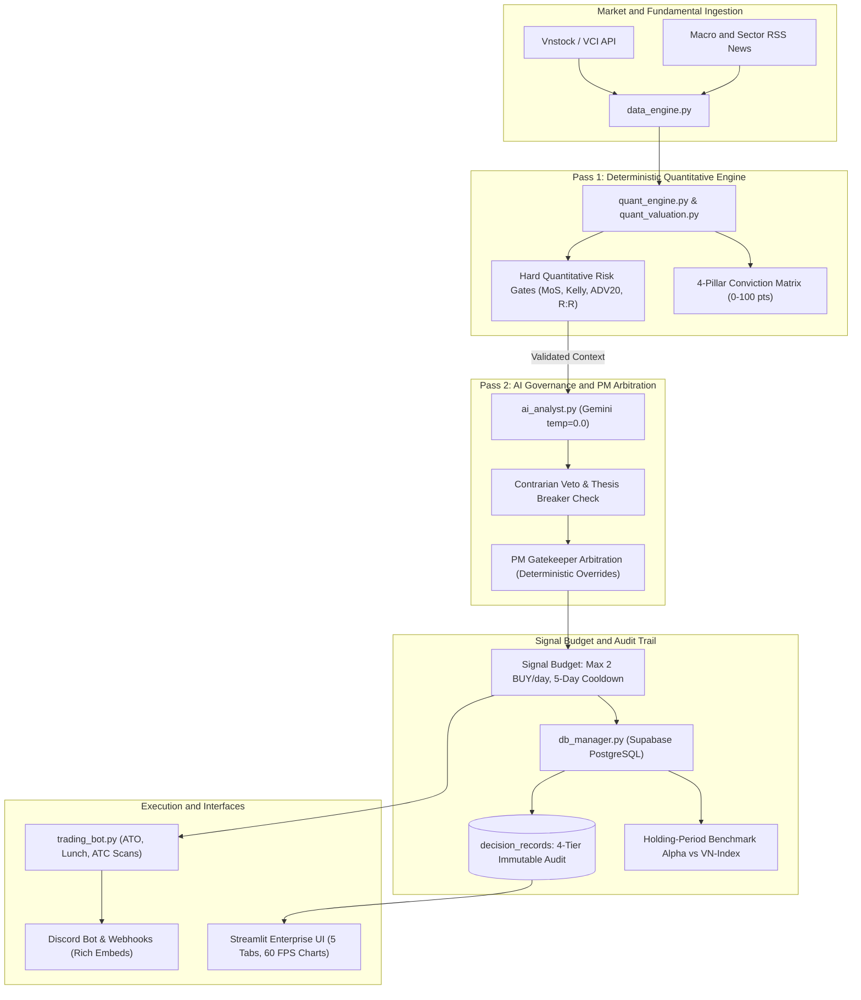

[](https://sonarcloud.io/summary/new_code?id=VinhTung1410_Stock-AI)
[](https://sonarcloud.io/summary/new_code?id=VinhTung1410_Stock-AI)
[](https://sonarcloud.io/summary/new_code?id=VinhTung1410_Stock-AI)
[](https://sonarcloud.io/summary/new_code?id=VinhTung1410_Stock-AI)


# Stock-AI 📈

> **An institutional-grade quantamental stock analysis and trading governance system for the Vietnam Stock Exchange (HOSE/HNX) — combining deterministic financial engineering with veto-only AI governance.**

**[🌐 Live Demo](https://stock-ai-recq.onrender.com/)** · **[🧭 Product Case Study](docs/PRODUCT_CASE_STUDY.md)** · **[📖 Architecture Docs](docs/PROJECT_STRUCTURE.md)** · **[📜 Engineering Workflow](docs/AI-workflow/GLOBAL/WORKFLOW.md)**

---

## 💡 Core Philosophy: *"Python Computes. AI Only Judges."*

Large Language Models (LLMs) hallucinate financial ratios (e.g., misreading an 8% ROE as 28%). In financial markets, bad data leads to ruined portfolios.

Stock-AI enforces **strict architectural separation**:
1. **Pass 1 — Deterministic Python Engine**: Computes Piotroski F-Score, Altman Z-Score, 4-Archetype Intrinsic Valuation, Dynamic ATR, and Half-Kelly sizing with zero LLM involvement.
2. **Hard Quantitative Gates**: Instantly **REJECTS** recommendations if Margin of Safety < 8%, Risk/Reward < 1.5×, or Kelly ≤ 0.
3. **Pass 2 — Veto-Only AI Governance (Gemini, `temp=0.0`)**: Evaluates qualitative catalysts, corporate governance, and contrarian thesis breaker risks using **only** pre-verified numbers from Pass 1. The LLM cannot invent numbers or override quantitative gates; it only holds veto power.

---

## 🆕 Recent Updates (v12.0)
- **API Caching & TTL:** Introduced a 12-hour TTL cache for `vnstock` financial endpoints to prevent rate-limit blocks and speed up execution.
- **Webhook 2-Pass Governance:** Enforced Cooldown (5 days), Daily Signal Budget, and Max Open Positions limits directly on Webhook 2-Pass and UI flows.
- **Data Integrity:** Removed stochastic noise from P/E and P/B market valuations for strictly deterministic reports.
- **Canonical Regime Tracking:** Implemented Single Source of Truth macro tracking via `get_canonical_regime()` to synchronize portfolio allocation.

## 🏗️ System Architecture


```mermaid
flowchart TD
    subgraph MarketData ["Market and Fundamental Ingestion"]
        VCI["Vnstock / VCI API"] --> DE["data_engine.py"]
        RSS["Macro and Sector RSS News"] --> DE
    end

    subgraph DeterministicCore ["Pass 1: Deterministic Quantitative Engine"]
        DE --> QE["quant_engine.py & quant_valuation.py"]
        QE --> Gates["Hard Quantitative Risk Gates (MoS, Kelly, ADV20, R:R)"]
        QE --> Conviction["4-Pillar Conviction Matrix (0-100 pts)"]
    end

    subgraph AIGovernance ["Pass 2: AI Governance and PM Arbitration"]
        Gates -->|Validated Context| AI["ai_analyst.py (Gemini temp=0.0)"]
        AI --> Veto["Contrarian Veto & Thesis Breaker Check"]
        Veto --> PM["PM Gatekeeper Arbitration (Deterministic Overrides)"]
    end

    subgraph SignalIntegrity ["Signal Budget and Audit Trail"]
        PM --> Budget["Signal Budget: Max 2 BUY/day, 5-Day Cooldown"]
        Budget --> DB["db_manager.py (Supabase PostgreSQL)"]
        DB --> Rec[("decision_records: 4-Tier Immutable Audit")]
        DB --> Alpha["Holding-Period Benchmark Alpha vs VN-Index"]
    end

    subgraph Interfaces ["Execution and Interfaces"]
        Budget --> Bot["trading_bot.py (ATO, Lunch, ATC Scans)"]
        Bot --> Discord["Discord Bot & Webhooks (Rich Embeds)"]
        Rec --> UI["Streamlit Enterprise UI (5 Tabs, 60 FPS Charts)"]
    end
```

---

## ⚡ Key Capabilities

| Pillar | Capability | Technical Details |
|---|---|---|
| **Quantitative Rigor** | **Financial Health & Bankruptcy Scoring** | Full Piotroski F-Score (0–9) across profitability, leverage, and efficiency; Altman Z-Score (Safe/Grey/Distress). |
| | **4-Archetype Intrinsic Valuation** | Dedicated valuation models tailored for Banks (P/B vs ROE), Cyclicals, Real Estate (RNAV), and Growth (DCF/DDM). |
| | **Dynamic Risk & Position Sizing** | Dynamic ATR stop-loss clamping, Half-Kelly criterion, and HOSE 20-day liquidity tiering (ADV20). |
| | **Data Resilience (v11.0)** | Robust fallback valuation and invalid ticker defenses eliminating pipeline crashes via ZeroDivisionError. |
| **Signal Credibility** | **4-Pillar Conviction Matrix** | Strict 100-point gate (Valuation 40%, Technical 25%, Catalyst 20%, Liquidity 15%). Buy threshold ≥ 70 pts. |
| | **Budget & Overload Defense** | Hard cap of Max 2 BUY signals/day; 5-day ticker cooldown; maximum 8 concurrent open positions. |
| | **Market Microstructure Shields** | **GDKHQ Shield** (ignores dividend gap-downs) + **Anti-Chasing Filter** (blocks buying at HOSE ceiling +6.85%). |
| **Enterprise Audit** | **4-Tier Immutable Decision Records** | Cryptographic hash audit (`input_hash`, `prompt_hash`), provenance metadata, and database trigger mutation lock. |
| | **Holding-Period Benchmark Alpha** | Computes true alpha against VN-Index for exact holding windows, tracking Win Rate and Profit Factor. |
| **Exit Hypothesis Lab** | **4 Systematic Exit Policies** | Compares Trailing ATR, Time-Decay, Regime-Adaptive, and Macro-Stop exits using Paired Bootstrap ($B=1,000$). |
| | **Spearman IC & FDR Screening** | Calculates Information Coefficient (IC) with Benjamini-Hochberg FDR filter to prune uninformative signals. |

---

## 🖥️ Interactive Web Dashboard & 24/7 Bot

The platform provides a 5-tab institutional analytics dashboard powered by Streamlit:

* **Tab 1: Portfolio & Risk Budgeting** — Real-time NAV computation, asset allocation, regime-based risk budgets, and dynamic trailing stops.
* **Tab 2: Technical & Valuation Charts** — Native 60 FPS TradingView Lightweight Charts (8 timeframes) + Apache ECharts historical P/E and P/B percentile bands.
* **Tab 3: Macro & Sector Intelligence** — Real-time RSS ingestion with NLP keyword extraction for sector drivers, rate hikes, and insider transactions.
* **Tab 4: AI Quantamental Analyst** — 2-Pass CFA-grade investment memos with anti-hallucination sanitization.
* **Tab 5: Alpha Tracker & Exit Lab** — Immutable Supabase audit records, regime backtest v4.0 (HOSE T+2.5 accounting), and exit policy performance comparisons.

**Automated 24/7 Trading Bot (`trading_bot.py`):**
* Runs scheduled market scans at **ATO (08:45)**, **Noon (11:30)**, and **ATC (14:30)**.
* Dispatches formatted Discord rich embeds and private DMs with automatic message splitting for large investment theses.

---

## 🛠️ Tech Stack

* **Frontend**: Streamlit, TradingView Lightweight Charts, Apache ECharts.
* **AI Core**: Google Gemini (`gemini-2.5-flash` / `gemini-1.5-flash`), `temp=0.0`, Pydantic deterministic parsing.
* **Quantitative & Backtest**: Python 3.11+, pandas, numpy, scipy, statsmodels.
* **Database & Storage**: Supabase (PostgreSQL), REST client, trigger-enforced immutable tables.
* **Data Providers**: `vnstock`, CafeF RSS, Google News.
* **Alerting**: Discord Webhooks & Bot API.
* **CI/CD & Security**: GitHub Actions, Ruff, SonarCloud, Pytest, Pip-audit.

---

## 🧪 Testing & Enterprise Quality Gates

Stock-AI adheres to rigorous institutional CI/CD and SonarCloud Quality Gate standards:

```
Total Test Cases : 289 passed (100% green)
Execution Time   : ~25 - 30 seconds
Coverage Target  : ≥ 80% on all core quantitative engines
Linter / Style   : Ruff (PEP 8, I001 sorted imports, zero warnings)
Code Smells      : 0 (Cognitive Complexity < 15, S8572 logging compliance)
Database Guard   : Auto DB Test Shield in conftest.py (zero live DB pollution during tests)
```

Run test suite locally:
```bash
# Run all unit and quantitative tests
pytest tests/ -v

# Run with coverage report
pytest tests/ --cov=quant_engine --cov=data_gate --cov=backtest_engine

# Run Ruff style & linting check
ruff check .
```

---

## 🚀 Quick Start

### 1. Clone & Set Up Environment

**Windows (PowerShell):**
```powershell
git clone https://github.com/VinhTung1410/Stock-AI.git
cd Stock-AI
python -m venv $HOME\.venv
& "$HOME\.venv\Scripts\Activate.ps1"
pip install -r requirements.txt
```

**macOS / Linux:**
```bash
git clone https://github.com/VinhTung1410/Stock-AI.git
cd Stock-AI
python3 -m venv ~/.venv
source ~/.venv/bin/activate
pip install -r requirements.txt
```

### 2. Configure Environment Variables

```bash
cp .env.example .env
# Fill in GEMINI_API_KEY, SUPABASE_URL, SUPABASE_KEY, DISCORD_WEBHOOK_URL
```

### 3. Launch Application

* **Web Dashboard**:
  ```bash
  python -m streamlit run app.py
  # Available at http://localhost:8501
  ```
  *(Windows users can also double-click `scripts/run_dashboard.bat`)*

* **Background Monitoring Bot**:
  ```bash
  python trading_bot.py
  ```

---

## 📁 Repository Structure

```
Stock-AI/
├── app.py                      # Streamlit dashboard entrypoint
├── trading_bot.py              # 24/7 background scanner & scheduler
├── ai_analyst.py               # 2-Pass quantamental AI & PM gatekeeper
├── quant_engine.py             # Deterministic metrics (F-Score, Z-Score, Kelly, Gates)
├── quant_valuation.py          # 4-Archetype fair value valuation models
├── data_engine.py              # Market data ingestion (vnstock, technicals, news)
├── data_gate.py                # Input data freshness and corruption filter
├── backtest_engine.py          # Regime-aware backtest engine (HOSE T+2.5 accounting)
├── db_manager.py               # Supabase persistence & audit records
├── components/                 # TradingView & ECharts visualizations
├── tabs/                       # Streamlit UI tabs (Portfolio, Charts, Macro, AI, Alpha)
├── migrations/                 # PostgreSQL migrations (0003_decision_records.sql)
├── tests/                      # 289 deterministic unit & integration test cases
│   ├── conftest.py             # Test configuration & automatic DB write shield
│   └── test_task_*.py          # Task-aligned test suites (Task 1 to 16)
└── docs/                       # Architecture diagrams, ADRs, and workflows
```

---

## 📄 License

Distributed under the **MIT License**. See `LICENSE` for more information.
