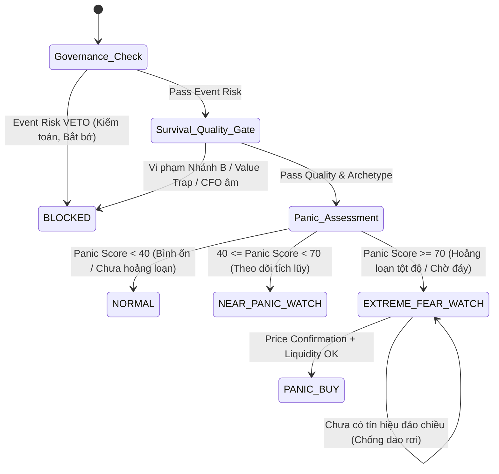

# 🏛️ ADR-0009: Contrarian 4-State Machine & Archetype Isolation Architecture

**Mã quyết định:** `ADR-0009`  
**Ngày ban hành:** 2026-10-04  
**Trạng thái:** `APPROVED`  
**Phiên bản hệ thống:** v14.0 (Phase 25)  
**Phạm vi:** `contrarian_engine.py`, `ai_analyst.py`, `tests/`  

---

## 1. Ngữ cảnh & Vấn đề (Context & Problem Statement)

Trong các phiên bản trước (v9.0 - v10.0), module Bắt đáy hoảng loạn (Contrarian Engine) gặp phải 3 vấn đề kiến trúc nghiêm trọng:
1. **Lệch chuẩn Enum State:** Trạng thái `STATE_PANIC_WATCH` ("PANIC_WATCH") và `STATE_ENTRY_ELIGIBLE` ("ENTRY_ELIGIBLE") không phản ánh đúng ngữ nghĩa so với thiết kế State Machine.
2. **Trộn lẫn Nhánh B (Archetype Overlays):** Các kiểm tra sống còn đặc thù (Ngân hàng: NPL, BĐS: D/E, Chứng khoán: Leverage, Phi tài chính: Z-Score) nằm lẫn trong logic chấm điểm chất lượng chung.
3. **Trùng lặp ngưỡng RSI:** `CONTRARIAN_MAX_RSI_NORMAL` và `CONTRARIAN_MAX_RSI_WATCH` bị cấu hình trùng giá trị `35.0`, gây mất tính phân loại giữa vùng bình thường và vùng bắt đầu hoảng loạn.

---

## 2. Quyết định Kiến trúc (Architectural Decision)

### 2.1. Chuẩn hóa 4 Trạng thái Cốt lõi (Core State Machine)

Hệ thống Contrarian phân định 4 trạng thái danh định:
- `STATE_NORMAL = "NORMAL"`: Cổ phiếu đạt tiêu chuẩn cơ bản và định giá nhưng thị trường bình ổn (Panic Score < 40 hoặc RSI > 35).
- `STATE_NEAR_PANIC_WATCH = "NEAR_PANIC_WATCH"`: Cổ phiếu chất lượng cao, định giá hấp dẫn, hoảng loạn mấp mé (40 <= Panic Score < 70 hoặc 30 < RSI <= 35).
- `STATE_EXTREME_FEAR_WATCH = "EXTREME_FEAR_WATCH"`: Hoảng loạn tột độ (Panic Score >= 70 hoặc RSI <= 30) nhưng chưa có xác nhận đảo chiều kỹ thuật (dao đang rơi).
- `STATE_PANIC_BUY = "PANIC_BUY"`: Hoảng loạn tột độ + Xác nhận đảo chiều (Price Confirmation + Liquidity Gate).

### 2.2. Phân Tách Nhánh B (Archetype Overlays)

Tách biệt toàn bộ logic kiểm tra sống còn ngành ra khỏi `_check_fundamental_integrity()` thành helper `_check_archetype_specific_gates(sector, fin_dict, result)`:
- **Ngân hàng:** $NPL \le 3.0\%$ (miễn trừ kiểm tra Piotroski F-score data completeness do đặc thù BCTC ngân hàng).
- **Chứng khoán:** Đòn bẩy tài chính $\le 3.0x$.
- **Bất động sản:** Tỷ lệ $D/E \le 1.5x$.
- **Phi tài chính:** Altman Z-Score $> 2.0$ và $D/E \le 1.0x$.

### 2.3. Sửa Lỗi Ngưỡng RSI

- `CONTRARIAN_MAX_RSI_WATCH = 35.0` (Ngưỡng kích hoạt Near-Panic Watch).
- `CONTRARIAN_MAX_RSI_EXTREME = 30.0` (Ngưỡng hoảng loạn tột độ).

---

## 3. Sơ đồ Chuyển dịch Trạng thái (State Transition Diagram)

---

## 4. Hệ quả & Lợi ích (Consequences & Benefits)

- **Ngữ nghĩa chuẩn mực:** Loại bỏ hoàn toàn sự mập mờ giữa cổ phiếu rác và cổ phiếu tốt đang ở vùng gom.
- **Cognitive Complexity giảm:** Code tách hàm rõ ràng, tuân thủ SonarCloud S3776 (< 15).
- **Cách ly an toàn:** Nhánh B độc lập giúp bổ sung tiêu chí ngành mới mà không ảnh hưởng đến luồng chung.
