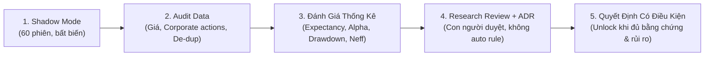

# 🎯 YÊU CẦU DỰ ÁN (CLIENT BRIEF) - VERSION 14.0

**Tên dự án:** Stock-AI / AI Investment Decision & Research Platform  
**Phiên bản:** v14.0 — Phase 25: Contrarian P0 Remediation, Golden Fixtures, Scan Observability & Shadow Mode Evaluation  
**Trọng tâm cốt lõi:**  
> *"Tôi sẽ phân biệt rõ: **ĐÃ HOÀN TẤT TRIỂN KHAI SHADOW MODE ≠ ĐÃ CHỨNG MINH CHIẾN LƯỢC BẮT ĐÁY CÓ LỢI THẾ ĐẦU TƯ (EDGE/ALPHA)**.  
> Hoàn thành triển khai code chỉ là điều kiện cần về mặt kỹ thuật, không phải bằng chứng kinh tế để kết luận chiến lược có lợi thế đầu tư."*

---

## 1. ĐÁNH GIÁ NHANH PHASE 25 — v14.0

| Hạng mục | Thực trạng đánh giá | Kết luận / Trạng thái |
|---|---|:---:|
| **An toàn vận hành** | Không phát sinh lệnh mua thật; Shadow Mode đang bật. | `Đạt theo báo cáo` |
| **Lưu vết quyết định** | Đã ghi nhận snapshot vào Supabase và có script theo dõi forward returns. | `Đạt theo báo cáo` |
| **Bằng chứng về hiệu quả đầu tư** | Mới bắt đầu thu thập; chưa đủ dữ liệu để kết luận có alpha. | `Chưa kiểm chứng` |
| **Kiểm thử và chất lượng code** | 19/19 unit tests và Ruff Exit code 0 theo kết quả báo cáo. | `Đạt theo báo cáo` |

> [!NOTE]
> **Lưu ý:** Đây là đánh giá dựa trên kết quả báo cáo, chưa phải xác minh trực tiếp code, dữ liệu Supabase hay các bài test độc lập.

---

## 2. BỐN TÍN HIỆU CẦN CHÚ Ý NHẤT & GÓC NHÌN PHẢN BIỆN

| Mã | Tín hiệu hiện tại | Góc nhìn phản biện |
|:---:|---|---|
| **PNJ** | RSI 9.2, Panic 50/100, F-Score 7/9 | Quá bán cực mạnh đáng nghiên cứu, nhưng **chưa chứng minh giá đã tạo đáy**. |
| **FPT** | RSI 31.4, MoS +25.7% | Cần xác minh Fair Value và **tính hữu ích thực sự của MoS** trước khi gọi là định giá hấp dẫn. |
| **DXG** | MoS +99.9%, F-Score 6/9 | Mức MoS rất lớn cần **kiểm tra giả định định giá, chất lượng tài sản và đòn bẩy**. |
| **DIG** | MoS +99.9%, F-Score 6/9 | Rủi ro tương tự DXG; **giá rẻ theo mô hình không đồng nghĩa cổ phiếu rẻ theo giá trị nội tại đáng tin cậy**. |

### Nhận định kỹ thuật bổ sung:
- **PNJ:** RSI 9.2 nhưng Panic Score chỉ 50/100. Đây không nhất thiết là lỗi: RSI và điểm hoảng loạn có thể đo hai khái niệm khác nhau. Tuy nhiên, cần ghi rõ công thức Panic Score và các thành phần đóng góp để hiểu vì sao hai chỉ báo không đồng thuận.
- **DXG & DIG:** Ưu tiên kiểm toán nguồn Fair Value trước khi phân tích sâu hơn tín hiệu bắt đáy.

---

## 3. BA ĐIỂM KIỂM TRA TRƯỚC KHI CHO SHADOW MODE TỐT NGHIỆP

### A. Expectancy Nhất Quán Với Profit Factor & Bổ Sung Expectancy Theo Đơn Vị R
- Cổng tốt nghiệp ban đầu yêu cầu 60 phiên, tối thiểu 30 mẫu T+10 và Win rate trên 55%. Đây là điều kiện khởi đầu, nhưng **chưa đủ để chứng minh lợi thế**.
- **Nghịch lý Win Rate:** Thắng 60% với +1% và thua 40% với -3% dẫn đến kỳ vọng toán học âm nặng:
  $$\mathbb{E}(R) = 0.6(1\%) - 0.4(3\%) = -0.6\%$$
- **Thống nhất phương pháp đo lường & R-Multiple:**
  1. **Expectancy (%):** Lợi nhuận kỳ vọng trung bình sau chi phí giả định (0.35%).
  2. **Expectancy (R-Multiple):** Chuẩn hóa theo mức rủi ro gánh chịu ($R = \frac{P_{\text{exit}} - P_{\text{entry}}}{P_{\text{entry}} - P_{\text{stop}}}$) để đánh giá đúng chất lượng chiến lược khi quy mô vị thế và độ biến động giữa các cổ phiếu là khác nhau.
  3. **Profit Factor:** Tổng lãi của các lệnh thắng chia tổng lỗ của các lệnh thua ($\ge 1.2$).
  4. **Benchmark Alpha:** Hiệu quả tương đối so với VN-Index hoặc VN30 trong cùng kỳ.
  5. **MAE/MFE:** Mức giảm bất lợi lớn nhất và mức tăng thuận lợi lớn nhất sau tín hiệu.
  - *Lưu ý:* T+10 là một chân trời đánh giá, không phải bằng chứng đủ để cho phép mở lệnh thật.

### B. Phân Biệt Rạch Ròi 4 Khái Niệm Cỡ Mẫu (Signal Clustering & Effective Sample Size)
- Gom tín hiệu cùng mã trong vòng 5 ngày (`deduplicate_signal_episodes`) là cách giảm trùng lặp theo thời gian, nhưng **số episode độc lập không tự động bằng Effective Sample Size thống kê ($N_{\text{eff}}$)** nếu nhiều mã cùng chịu cú sốc giảm sâu toàn thị trường.
- **Hệ thống bắt buộc báo cáo riêng 4 chỉ số:**
  1. `n_raw_signals`: Tổng tín hiệu ban đầu.
  2. `n_episodes`: Số episode sau khử trùng lặp theo thời gian (5 ngày).
  3. `n_distinct_sessions`: Số phiên độc lập có dữ liệu.
  4. `n_eff_estimated`: Effective Sample Size ước lượng theo mô hình tương quan chéo thị trường (Kish Design Effect: $N_{\text{eff}} = \frac{N_{\text{episodes}}}{1 + (\bar{m} - 1)\rho}$).
- Không dùng chung hai khái niệm nếu hàm chỉ thực hiện gom cụm theo thời gian.

### C. Đối Chiếu Schema & Đảm Bảo Tính Toàn Vẹn Dữ Liệu (`scripts/update_shadow_returns.py`)
- **Kiểm toán Schema Wide-Format:** Bảng `decision_forward_returns` lưu 1 bản ghi trên mỗi `decision_id` với các cột riêng biệt `t1_return_pct`, `t5_return_pct`, `t10_return_pct`, `t20_return_pct`.
- **Nguyên tắc Upsert An Toàn (Partial Upsert):**
  - Chỉ cập nhật các kỳ hạn đã có dữ liệu thực tế (khác `None`).
  - **Phân biệt rạch ròi:** Kết quả chưa đến hạn lưu `None` (Unmatured), không được gán hoặc hiểu nhầm thành `0.0%` (hòa vốn).
  - Tránh việc cập nhật T+5 vô tình ghi đè `None` làm mất kết quả T+1 đã tính toán từ trước.
- **Quy tắc Audit Khi Điều Chỉnh Giá & Corporate Actions:**
  - Snapshot price gốc được đọc từ `facts["snapshot_price"]` bất biến, không bị sửa sai lệch theo thời gian.
  - Sử dụng lịch giao dịch thực tế của HSX/HNX (không tính ngày nghỉ là phiên).

### D. Ý Nghĩa Cốt Lõi Của Ngưỡng 60 Phiên (Regime Coverage vs. Giấy Phép Giao Dịch Thật)
- **Phân biệt hai khái niệm:**
  - *60 phiên thử nghiệm:* Thời gian hệ thống hoạt động và ghi nhận dữ liệu (Liveness).
  - *30 episode:* Số cơ hội sau khi khử trùng lặp (Sample depth).
- **Rào cản Chế độ Thị trường (Regime Coverage):** Hai điều kiện này **không chứng minh chiến lược đã trải qua đủ chế độ thị trường**. Nếu 60 phiên đều nằm trong một đợt hồi phục (Uptrend), kết quả có thể không đại diện cho giai đoạn thị trường giảm mạnh hoặc đi ngang.
- **Nguyên tắc Stage-Gate:** Cổng tốt nghiệp hiện tại chỉ là **điều kiện để chuyển sang vòng đánh giá tiếp theo (Research Review & ADR)**, KHÔNG PHẢI giấy phép tự động mở giao dịch tiền thật. Tiếp tục giữ Shadow Mode cho đến khi có đủ bằng chứng về tính ổn định, chi phí thực thi và rủi ro giảm vốn (drawdown).

---

## 4. QUY TRÌNH KHUYÊN DÙNG TỪ BÂY GIỜ (5 BƯỚC)

1. **Shadow Mode — 60 phiên:** Giữ nguyên quy tắc; thu thập tín hiệu và snapshot bất biến.
2. **Audit chất lượng dữ liệu:** Kiểm tra giá, corporate actions, tín hiệu trùng lặp và tính tái lập.
3. **Đánh giá thống kê:** Expectancy, alpha, drawdown, chi phí và độ bất định của kết quả.
4. **Research review + ADR:** Phê duyệt hoặc bác bỏ giả thuyết; không tự động thay đổi rule.
5. **Quyết định có điều kiện:** Chỉ cân nhắc bước tiếp theo khi bằng chứng, rủi ro và cơ chế kiểm soát đều đạt yêu cầu.

> [!WARNING]
> **Phạm vi suy rộng:** Với 18 mã được lựa chọn trước, có thể đánh giá chiến lược trên tập mã đó, nhưng **chưa thể suy rộng kết quả cho toàn thị trường Việt Nam**.

---

## 5. VIỆC TIẾP THEO NÊN LÀM NGAY

> **Đóng băng tính năng mới cho Phase 25.** Thay vào đó, hãy kiểm toán đúng 3 file:
> 1. `contrarian_engine.py` — Cách tính Panic Score, MoS, điều kiện tạo tín hiệu và cơ chế khóa lệnh thật.
> 2. `scripts/update_shadow_returns.py` — Cách tính forward returns, xử lý dữ liệu và chống ghi trùng (idempotent).
> 3. `scripts/evaluate_shadow_graduation.py` — Toàn bộ tiêu chí tốt nghiệp và cách tính vượt ra ngoài Win rate đơn thuần.

Nếu ba phần này vững, Shadow Mode mới có thể tạo ra bằng chứng đáng tin cậy thay vì chỉ tạo ra nhiều báo cáo.

