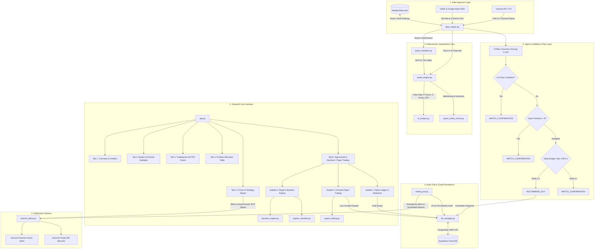

# 🏛️ PROJECT ARCHITECTURE & CODEBASE STRUCTURE (PROJECT_STRUCTURE.md)

This document provides a comprehensive technical breakdown of the source code architecture, directory taxonomy, module responsibilities, and data flows of the **Stock-AI** quantitative analysis copilot. It serves as the primary technical specification for code reviewers, Test Leads, and system maintainers deploying to Production (Render.com, Linux VPS, or Cloud Containers).

---

## 1. 📂 Repository Taxonomy & Module Roles

```text
Stock - learning/
│
├── app.py                      # 🚀 MAIN ENTRYPOINT (Streamlit Application)
│                               # - Page configuration, responsive layout, custom CSS (Dark/Light)
│                               # - Top navigation bar orchestrating 5 functional feature tabs
│
├── components/                 # 📊 VISUALIZATION ENGINE (Embedded Native Components)
│   ├── __init__.py             # Component exports
│   ├── tradingview_chart.py    # Native 60 FPS TradingView Lightweight Charts integration:
│   │                           # - Multi-timeframe support: 1m, 5m, 15m, 30m, 1h, 1D, 1W, 1M
│   │                           # - Independent subpanels: Volume, MACD, RSI with drag resizers
│   │                           # - Synchronized crosshair (#v-crosshair-line) & fixed price-axis width
│   └── echarts_valuation.py    # Apache ECharts Multiples Valuation Bands:
│                               # - Dual-axis: VN-Index (left) vs P/E or P/B bands (right)
│                               # - Historical Mean Valuation overlay & interactive DataZoom slider
│
├── tabs/                       # 📑 FEATURE TABS (Business Domain Logic)
│   ├── __init__.py             # Tab exports
│   ├── tab_overview.py         # Tab 1: Market & Portfolio Overview (NAV KPIs, Heatmap, 24h News)
│   ├── tab_market.py           # Tab 2: Market Breadth & Historical Multiples (P/E, P/B bands)
│   ├── tab_charts.py           # Tab 3: Deep Technical Inspection (TradingView 60 FPS charts)
│   ├── tab_portfolio.py        # Tab 4: Portfolio Allocation & In-place Editable Data Table
│   ├── tab_ai.py               # Tab 5: AI Strategy Analysis (2-Pass Quantamental + CFA Narrative)
│   └── tab_alpha_tracker.py    # Tab 6: Signal Audit, Regime Backtest & Paper Trading Platform:
│                               # - Subtab 1: Alpha Ledger (Post-Market Audit, MFE/MAE, Loss Attribution)
│                               # - Subtab 2: Regime Backtest Engine (Multi-Strategy, VN-Index Benchmark, Multi-line Equity)
│                               # - Subtab 3: Forward Testing Paper Trading (Live Supabase Signals, Implementation Shortfall)
│
├── backtest_engine.py          # 🚀 DETERMINISTIC HOSE BACKTEST & CRISIS MATRIX ENGINE
│                               # - Simulates HOSE microstructure: ±7% ceiling/floor, T+2.5 lag, fees/taxes
│                               # - Dynamic slippage model (15-200 bps) scaling on daily limits and volume ratios
│                               # - Multi-strategy signal generator: Quant Core (FA+MoS+Z-Score+TA), MA Crossover, RSI Reversion
│                               # - Dynamic Jensen's Alpha & Beta calculation against VN-Index benchmark
│                               # - Walk-Forward Backtesting (3-stage Train / Val / OOS split with frozen parameters)
│                               # - 11 Crisis Stress Scenarios & automated Flash Crash scanner
│                               # - Sub-equity curve decomposition across 4 market regimes (Full, Uptrend, Downtrend, Sideways)
│
├── regime_classifier.py        # 🧭 OBJECTIVE MARKET REGIME CLASSIFIER
│                               # - Classifies market environment: UPTREND, DOWNTREND, SIDEWAYS
│                               # - Methodologies: MA200 Slope & Momentum-Volatility with adaptive windows
│                               # - Operates strictly on VN-Index to eliminate Regime Tautology
│
├── paper_trading.py            # 📝 FORWARD TESTING & SHORTFALL FRAMEWORK
│                               # - Measures execution drag via Implementation Shortfall (bps)
│                               # - Enforces daily signal budgets, holding cooldowns, and virtual position tracking
│                               # - Supports ablation testing: Quant Only vs Quant + LLM
│
├── db_manager.py               # 🗄️ PERSISTENCE & AUDIT (Supabase PostgreSQL REST Client)
│                               # - Immutable snapshot logging (`signals`) and lifecycle tracking (`signal_lifecycle`, `signal_tracking`)
│                               # - Preserves `initial_stop_price` independently from dynamic trailing stops
│                               # - Post-market audit engine (15:15 UTC+7) computing MFE, MAE, T+ marks
│                               # - Quantitative performance metrics query (Hit Rate, Profit Factor, Expectancy, ESS, Alpha)
│                               # - Cross-day cooldown verification (`check_symbol_recent_signal`)
│
├── quant_engine.py             # 📐 DETERMINISTIC QUANTITATIVE CORE (Python Engine)
│                               # - Data Gate: Recency validation & minimum liquidity filter (ADV20)
│                               # - Piotroski F-Score (0-9): Fundamental financial health scoring
│                               # - Altman Z-Score: Bankruptcy probability classification (Safe / Grey / Distress)
│                               # - ATR(14) Volatility Stop-Loss: Dynamic volatility-based risk thresholds
│                               # - Hard Gates: Expected Value, Margin of Safety (MoS), Half-Kelly Criterion
│                               # - Sector Concentration Guard: Max 3 positions or ≤ 25% NAV per economic sector
│                               # - Statistical Significance: Bootstrap Sharpe CI (10,000 resamples, p-value, ESS)
│                               # - Scientific Efficacy: Dual-arm A/B comparison (`ARM_QUANT_ONLY` vs `ARM_QUANT_AI`)
│                               # - AI Calibration & Safety Breaker: Brier Score, Reliability Curve, demotion on gap > 0.15
│                               # - Monte Carlo Tail Risk Engine: 2,000 resamples, P95/P99 Drawdown, P(DD > 15%)
│                               # - Portfolio Optimization: Risk Parity / Equal Risk Contribution (25% single-stock cap)
│                               # - Multi-Factor Beta: OLS Market Beta, Sector Beta & Idiosyncratic Alpha
│                               # - Trade Execution: Partial Profit Lock (50% at +12%), Breakeven stop (+0.3%), Trailing stop
│
├── quant_valuation.py          # 🎯 4-ARCHETYPE VALUATION ENGINE
│                               # - Sector archetype classification (Bank, Cyclical, Real Estate, Growth)
│                               # - Valuation models: P/B regression, Historical Median, SOTP, DCF/Graham
│                               # - Deterministic Margin of Safety (MoS %) calculation
│
├── quant_sanity_check.py       # 🛡️ MATHEMATICAL CONSISTENCY & SANITY GUARD
│                               # - Enforces 6 invariant financial rules (e.g., Profitable != Cut Loss)
│                               # - Dynamic Trailing Stop clamping: Clamped strictly < Current Price
│
├── data_engine.py              # ⚙️ DATA INGESTION & RISK ENGINE
│                               # - Market data feeds: Vnstock (VCI source), Google News, CafeF RSS
│                               # - Prompt Injection Defense: `sanitize_news_for_llm` isolating untrusted RSS text
│                               # - Historical index feeds: `fetch_index_historical("VNINDEX")` for benchmark tracking
│                               # - Technical indicators: MA20, MA50, RSI14, Vol/SMA20, Smart Money Flow
│                               # - 4-Pillar Conviction Scoring Matrix (0-100 points)
│                               # - 5-Day Cross-Day Cooldown deduplication (Supabase-first + local JSON fallback)
│                               # - Daily Signal Budget (Max 2 BUYs/day) & Portfolio Guard (Max 8 positions)
│
├── ai_analyst.py               # 🧠 AI STRATEGY LAYER (Gemini Flash LLM)
│                               # - 2-Pass Quantamental pipeline: Python calculates -> Gemini interprets
│                               # - Web-to-Discord hook: Automatically dispatches BUY signals to Client Discord DM
│                               # - Anti-Hallucination Guard: Deterministic regex sanitizer eliminating CJK tokens
│                               # - Sliding Window Rate Limiter: 12/15 RPM buffer on Gemini Free Tier with auto-cooldown
│                               # - CFA-grade institutional report generation
│
├── discord_alerts.py           # 🔔 NOTIFICATION & COMPLIANCE ENGINE (Discord Webhooks & Bot)
│                               # - Legal Disclaimer Firewall: Mandatory `SIGNAL_DISCLAIMER` under Securities Law 2019
│                               # - Formatted Rich Embeds with color-coded conviction tiers
│                               # - Direct Message (DM) private alerts for urgent risk triggers & Web BUY signals
│                               # - Daily operational heartbeat (08:30) and Gemini Rate Limit congestion warnings
│                               # - Watchlist pruning notification dispatched once daily before ATO (08:45)
│                               # - Smart Regex message chunker preserving Discord 4096-char limits
│
├── trading_bot.py              # 🤖 24/7 BACKGROUND WORKER (Automated Trading Bot)
│                               # - Autonomous loop aligned with Vietnam Trading Sessions (UTC+7)
│                               # - Pre-ATO System Heartbeat dispatched daily at 08:30
│                               # - Real-time risk audit (< 1s latency): Stop loss, Trailing stop, Ceiling check
│                               # - Scheduled strategy dispatches: 08:45 (ATO), 11:30 (Lunch), 14:45 (ATC)
│                               # - Once-per-day Watchlist pruning guard before ATO (08:45)
│                               # - Post-market audit trigger at 15:15 UTC+7
│
├── run_cloud.py                # ☁️ CLOUD DUAL-PROCESS RUNNER
│                               # - Concurrently runs Trading Bot Daemon (Thread 1) + Streamlit UI (Thread 2)
│                               # - Tailored for single-container cloud hosting (Render.com, Koyeb, Docker)
│
├── migrations/                 # 🏛️ DATABASE SCHEMAS & MIGRATIONS
│   └── 0002_create_signal_lifecycle.sql # Schema `signal_lifecycle` isolating initial risk marks
│
├── tests/                      # 🧪 COMPREHENSIVE TEST SUITE (222 tests, 100% Pass)
│   ├── conftest.py             # Pytest configuration and 100% offline mock fixtures (Zero Discord Leak)
│   ├── test_backtest_engine.py # HOSE ceiling, T+2.5, slippage, Alpha/Beta vs VN-Index, Quant Core, Stop-Loss
│   ├── test_regime_classifier.py # MA200 slope, momentum-volatility, adaptive windowing
│   ├── test_paper_trading.py   # Implementation Shortfall, execution lag, order management
│   ├── test_sanity_checks.py   # Invariant rules, R:R calculation, trailing stop clamping
│   ├── test_v2_system.py       # Archetype valuation, holding evaluation, market regime
│   ├── test_alpha_and_lifecycle.py # GDKHQ dividend shield, anti-chasing, Supabase lifecycle, R-Multiple, ESS
│   ├── test_task_0004_ui_and_web_hook.py # Streamlit tab rendering and Web-to-Discord hook verification
│   ├── test_signal_budget.py   # 4-pillar conviction, 5-day cooldown, budget cap, portfolio guard
│   ├── test_task_0006_regime_first.py # Regime-first gating across backtest and quant pipelines
│   ├── test_task_0008_sector_and_slippage.py # Sector concentration, dynamic slippage, Gemini rate limiter
│   ├── test_v53_walkforward_and_bootstrap.py # Walk-Forward OOS, 11-crisis stress matrix, Bootstrap Sharpe CI
│   ├── test_v54_ai_validation_and_ab_arms.py # Quant-Only vs Quant+AI A/B arms, AI calibration curve, circuit breaker
│   └── test_v55_advanced_quant_portfolio.py # Monte Carlo drawdown tail risk, Risk Parity sizing, Multi-Factor Beta, Partial profit lock
│
├── data/                       # 💾 DATA ARTIFACTS & LOCAL PERSISTENCE
│   ├── portfolio.json          # Portfolio holdings state
│   ├── watchlist.json          # Monitored watchlist state
│   └── .signal_cooldown.json   # Local fallback cache for 5-day signal cooldown
│
└── docs/                       # 📚 DOCUMENTATION & WORKFLOW
    ├── AI-workflow/            # Multi-Agent Workflow governance (Client.md, GLOBAL/, ROLES/, TASK/)
    ├── PRODUCT_CASE_STUDY.md   # Architectural decisions, RCA deep dives (v1.0 to v5.5)
    ├── PROJECT_STRUCTURE.md    # Codebase architecture specification (This file)
    └── rule.md                 # System operational rules and quant constraints
```

---

## 2. 🔄 End-to-End Data Flow Architecture



---

## 3. 🛡️ Institutional Signal Credibility & Quantitative Backtest Specifications

The system implements strict anti-dilution risk controls, realistic exchange friction simulation, and institutional hedge-fund governance:

| Mechanism | Configuration | Implementation File | Rationale |
|---|:---:|---|---|
| **Legal Disclaimer Firewall** | Securities Law 2019 Art. 10 & 82 | `discord_alerts.py` | Mandates statutory non-brokerage disclaimer on 100% of Discord public alerts and private DMs. |
| **Prompt Injection Defense** | Regex Blocklist + Length Caps | `data_engine.py` | Sanitizes untrusted RSS news headlines/summaries before injection into LLM prompts. |
| **Signal Lifecycle & Evidence** | `initial_stop_price` isolation | `db_manager.py` + `quant_engine.py` | Guarantees mathematically untainted R-Multiple, Expectancy, and Effective Sample Size (ESS). |
| **Quant Core Parameter Lock** | ADR-0001 Invariant Freeze | `quant_engine.py` | Locks F-Score $\ge 6$, MoS $\ge 15\%$, Z-Score $>1.8$, RSI $<70$, Sector $\le 25\%$ to prevent Data Snooping. |
| **Conviction Matrix** | $\ge 70$ pts for BUY | `data_engine.py` | Requires confluence across Valuation (40), Technicals (25), Catalyst (20), Flow (15). |
| **5-Day Cooldown** | 5 Trading Days | `data_engine.py` + `db_manager.py` | Prevents firing duplicate BUY recommendations for the same symbol across consecutive sessions. |
| **Daily Signal Budget** | Max 2 BUYs / Day | `data_engine.py` | Forces capital concentration into the top 2 highest-conviction ideas; ranks by score, vol, and R:R. |
| **Portfolio Guard** | Max 8 Positions | `data_engine.py` + `db_manager.py` | Limits total concurrent active positions to prevent liquidity risk and excessive portfolio fragmentation. |
| **Sector Concentration Guard** | Max 3 stocks or $\le 25\%$ NAV | `quant_engine.py` | Eliminates systemic cross-asset contagion by capping aggregate exposure in any single sector. |
| **GDKHQ Shield** | Ex-dividend Gap Filter | `data_engine.py` + `tests/test_alpha_and_lifecycle.py` | Prevents artificial ex-rights price drops from triggering false stop-loss alerts. |
| **Anti-Chasing Filter** | Ceiling Check (+6.85%) | `data_engine.py` + `backtest_engine.py` | Automatically vetoes buy orders when price is pinned at HOSE upper trading limit. |
| **HOSE Settlement Lag** | Strict T+2.5 Rule | `backtest_engine.py` | Stock bought at day T can only be liquidated starting from the afternoon session of T+2. |
| **Dynamic Slippage Model** | 15 to 200 bps Slippage | `backtest_engine.py` | Dynamically penalizes ceiling buys (60 bps), floor sells (75 bps), and illiquid order sizes. |
| **Gemini Rate Limiter** | 12/15 RPM Sliding Window | `ai_analyst.py` + `discord_alerts.py` | 60-second sliding-window tracker preventing HTTP 429 quota exhaustion on Gemini Free Tier. |
| **VN-Index Benchmark** | Dynamic Jensen's Alpha & Beta | `backtest_engine.py` + `data_engine.py` | Calibrates relative performance against VN-Index; computes true systematic beta (e.g., VIC $\beta=1.78$). |
| **Adaptive Regime Partition** | MA200 Slope & Momentum-Vol | `regime_classifier.py` | Evaluates strategy CAGR, MDD, and Sharpe across Full, Uptrend, Downtrend, and Sideways cycles. |
| **Walk-Forward Validation** | 3-Stage Train / Val / OOS Split | `backtest_engine.py` | Evaluates strategy robustness on pure Out-of-Sample data (2022-2024) with frozen historical parameters. |
| **Crisis Stress Matrix** | 11 Historical Crisis Shocks | `backtest_engine.py` | Stress tests survival across Trade War 2018, COVID 2020, Bond Crisis 2022, and Flash Crashes. |
| **Bootstrap Sharpe CI** | 10,000 Vectorized Resamples | `quant_engine.py` | Computes empirical 95% Confidence Intervals, $p$-value ($H_0: \text{Sharpe} \le 0$), and autocorrelation ESS. |
| **Dual-Arm A/B Engine** | `QUANT_ONLY` vs `QUANT_AI` | `quant_engine.py` | Empirically proves whether generative AI delivers genuine Alpha or creates performance drag. |
| **AI Reliability Calibration** | Brier Score & Safety Breaker | `quant_engine.py` | Calibrates AI confidence across 5 bins; severs AI from Kelly sizing if calibration gap $> 0.15$. |
| **Monte Carlo Tail Risk** | 2,000 Forward Resamples | `quant_engine.py` | Simulates 63-day equity paths quantifying P95/P99 Max Drawdowns and tail breach probability. |
| **Risk Parity Sizing** | Inverse Volatility, 25% Cap | `quant_engine.py` | Equalizes risk contribution across holdings and redistributes excess weight iteratively. |
| **Multi-Factor Beta** | OLS Market, Sector & Alpha | `quant_engine.py` | Decomposes returns into Market Beta ($\beta_m$), Sector Momentum ($\beta_s$), and True Alpha ($\alpha$). |
| **Partial Profit Lock** | 50% at +12%, Breakeven Stop | `quant_engine.py` | Locks 50% profit at +12% target; raises remaining stop to Breakeven (+0.3%) and trails at +15%. |
| **Implementation Shortfall** | Basis Points (bps) Drag | `paper_trading.py` | Audits price degradation between algorithmic decision price and real post-market fill price. |

---

## 4. 🚀 Deployment Architecture (Production on Render.com)

1. **Dual-Process Orchestration (`run_cloud.py`)**:
   - Cloud PaaS services (e.g., Render free tier) allow only one exposed Web service port.
   - `run_cloud.py` starts the `TradingBot` daemon as a background worker thread (`start_bot_thread()`) while simultaneously running `streamlit run app.py` on the HTTP port bound by the container (`$PORT`).
2. **Persistence Resilience**:
   - Cooldown and signal audit states persist primarily in **Supabase PostgreSQL**.
   - If network degradation occurs, `data_engine.py` gracefully falls back to local storage (`data/.signal_cooldown.json`).
3. **Automated CI/CD (`.github/workflows/ci.yml`)**:
   - Lints all Python files using `ruff`.
   - Executes offline test suites (`pytest tests/ -m offline`) on every push to `main` and Pull Request.
